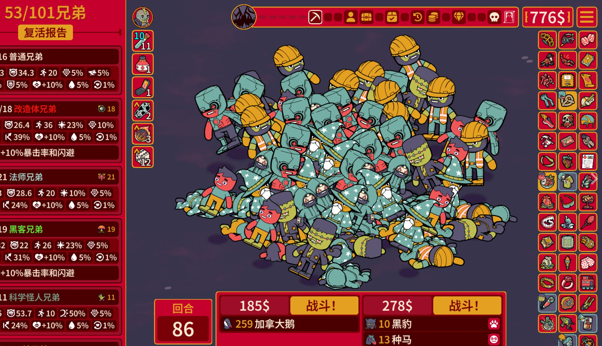
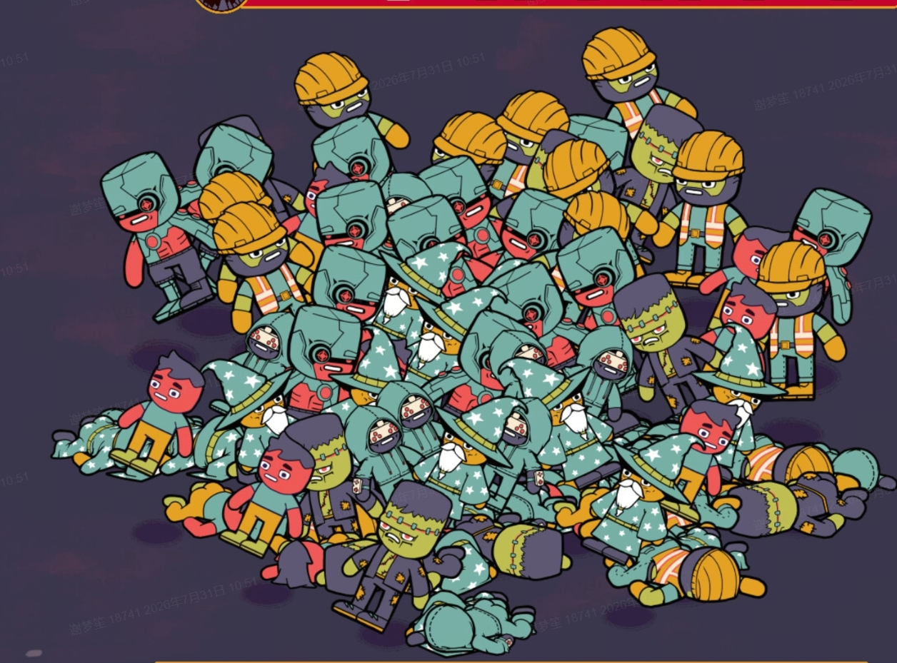
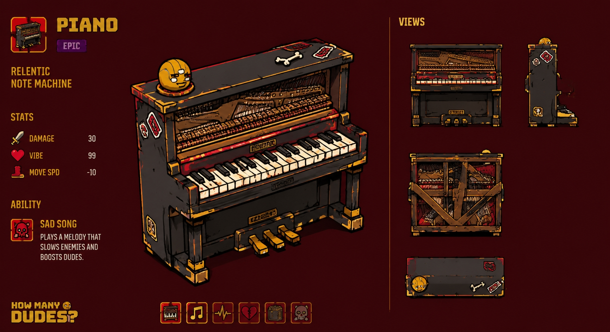
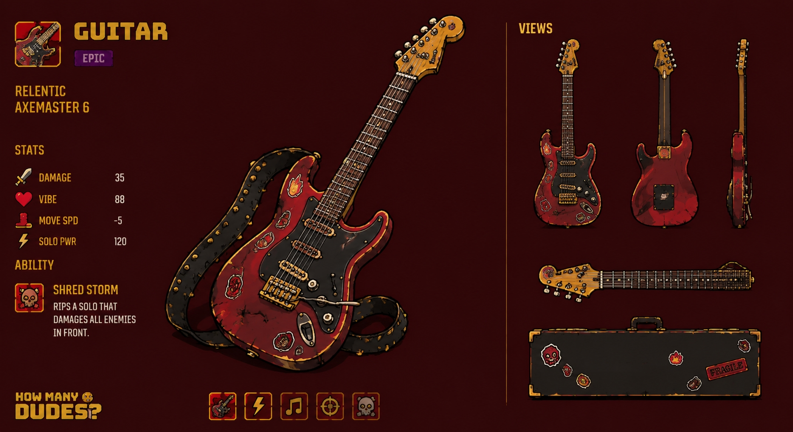
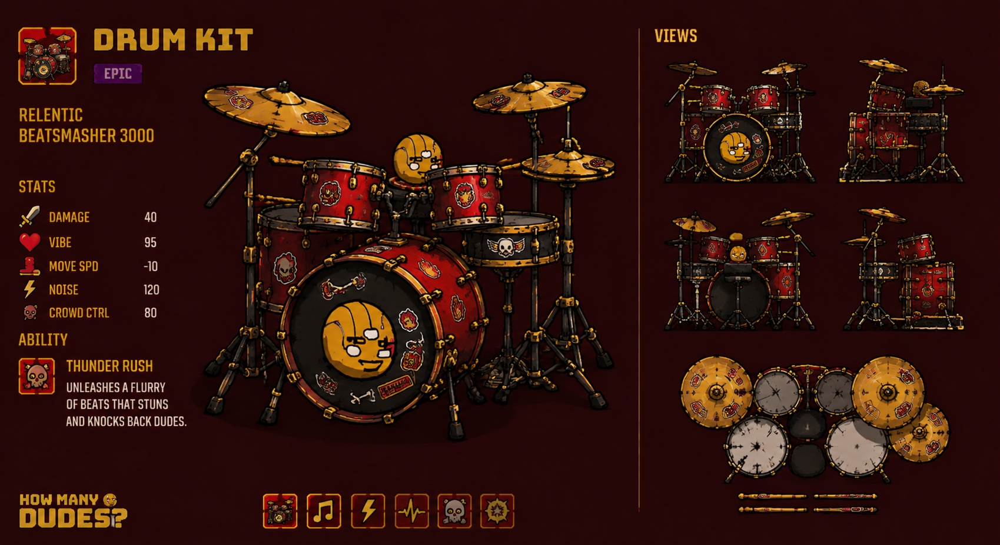
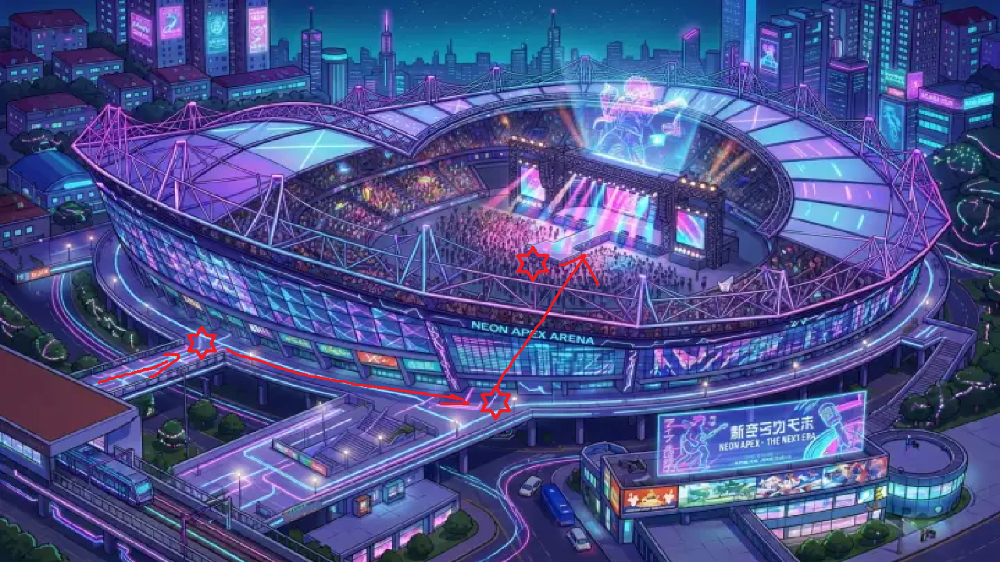
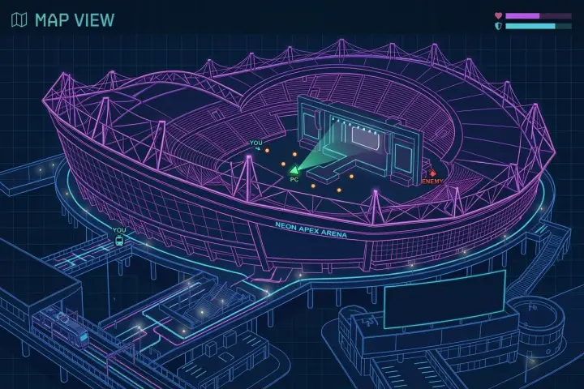

# 2D音乐弹幕游戏策划案 \(持续更新\)

> 文档边界，2026-08-12：本文主体保存产品目标、内容设想和待验证方案，不代表所有章节已经在 Web 原型中落地。当前可玩机制以《简化玩法策划案（当前原型版）》和《实机落地与调整记录》的“当前实机规则”为准；代码是最终事实源。

## 当前 Web 原型快照

| 系统 | 当前已落地表现 |
|---|---|
| 工程 | Phaser 4 + Vite + TypeScript；横向双联逻辑画布 `2560 x 720`，左侧俯视与右侧 FPV 各为 `1280 x 720`、`16:9`；146.32 BPM、4/4 拍 |
| 场地 | 单个深色战斗场地；左、右、下的人群律动条无碰撞并允许侵入战斗区，轻重拍明度 / 饱和度变化均不超过 5%；律动条与角色按脚底 Y 使用 TopDown 遮挡；左上 HP 血条同步做轻重拍压缩与跳动 |
| 玩家 | 外星角色临时素材；WASD/左摇杆惯性移动，鼠标/右摇杆瞄准，90 度辅助锁定 |
| 攻击 | 鼠标左/右键区分轻重，判定窗口为拍点前后各 `0.1s`；手柄 `RB` 自动采用当前拍要求，`LB` 闪避，`RT` 不攻击 |
| 武器 | 双持荧光棒与伸缩警棍；正确输入分别为 5 道最长 `720px` 的瞬时直光束 / 3 段紫色弯月刀光，错误输入只保留中间 1 道或 1 段；光束在最近敌人表面截断并给出轻量光电反馈 |
| 敌人 | 保安和粉丝各占一半；两者复用卡拍移动，每小节发射一次前 1 / 中 2 / 后 3 的六点阵列，分别掉落警棍和荧光棒 |
| 波次 | 五波，总数 `2 / 4 / 8 / 16 / 32` |
| 弹幕 | 玩家使用红色高亮直光束或紫色轻薄弯月刀光；保安使用青白描边胶囊点，粉丝使用暖红描边光点，敌方点弹无拖尾、存活 2 小节并在每拍前 `0.1s` 快速推进 |
| 节奏反馈 | `bgm3.mp3` 启动及每 616 拍循环时与节拍时钟同步；BGM / 叫喊音量为 `0.3 / 0.28`；节奏条预览未来 3 拍、间距 `120px`；四拍之间有小节分隔，事件音效按优先级踩拍 |
| Fever | 三倍能量获取，基础 16 拍；期间正确输入以半速回充并附加清弹音波 |
| 双视角 | 左侧俯视主视口与右侧只读伪 3D 第三人称等大并列；右侧将同一批 2D 对象投影成带白描边、支架和接地阴影的绘本立牌，并按距离遮挡；不接收攻击或标题点击 |
| 美术测试 | 网页右上角面板可实时替换背景、玩家、保安和粉丝；当前与后续对象同步更新，支持单项/全部恢复，刷新后回到默认素材 |

当前未落地：多房间、完整关卡、Boss、按关卡编排的正式音乐内容、场景伤害机关、多种中大型敌人进入波次、正式角色动画和剧情演出。下文涉及这些内容时均视为目标设计或待验证方案。

# 结论更新

⏰2026-08-04 11:00

- 先做美术风格探索，同期推进策划案细节补全保证可落地，原型先做武器和怪物战斗验证。

- 美术帧动画素材在web内需要联动验证

    1. 角色序列帧动作素材 测试动画

    2. 角色带攻击范围的序列帧测试

⏰2026-08-03 18:00

- 演唱会题材

- 保证对于音律、节拍的严肃性

- 可以在策划案内明确是大地图 or 箱庭地图 or 多关卡切换

⏰2026-07-30 11:00

- ~~多关卡多房间不重要，长线成长不重要~~

- 多人不重要，先保证单人画面感

- 武器、整体题材更偏向~~噪音演奏~~，搞怪的锣鼓喧天，尖叫鸡之类的

- 操作按键和维度不要太丰富

- 还是由玩家去像hifirush一样去跟拍，强调连续跟拍、关键跟拍的奖励

- ~~敌方和己方攻击以弹幕为主，扇面为辅~~

- 连续combo进fever time，可以发圆形、扇形音波清屏抵消

# 游戏基础信息

## 游戏类型

2D俯视角弹幕射击 × 音乐节奏 × 房间制闯关游戏

## 开发引擎

web phaser引擎

## 核心玩法

- 本作是一款融合节奏玩法的**2D俯视角射击游戏**

- 玩家在2D场景中自由移动和瞄准，使用不同节奏的武器消灭敌人，同时躲避敌人弹幕和随音乐变化的场景机关

- 玩家需要从关卡的一端出发，依次通过多个封闭战斗场景，清空当前房间内的全部敌人后开启出口，最终抵达关卡终点

- 玩家需要同时处理空间与时间两方面的挑战：在弹幕中寻找安全位置，并根据音乐节奏预判自己、敌人与场景下一次发生行动的时机

- 游戏中的武器开火、敌人攻击、场景中的激光和弹幕和背景演出都会与关卡音乐同步。玩家可以随时移动和输入攻击，但武器只会在自身对应的节奏点真正开火

## 目标用户群体

## 核心用户

- 喜欢俯视角射击和弹幕躲避的玩家；

- 喜欢节奏游戏，希望体验节奏与动作结合的玩家；

- 喜欢研究武器机制、敌人规律和战斗节奏的玩家；

- 喜欢快节奏、强视听反馈和重复挑战关卡的玩家

## 扩展用户

- 喜欢《元气骑士》等房间制动作闯关游戏的玩家；

- 喜欢音乐驱动型动作游戏的玩家；

- 不擅长传统音游精确按键，但能够感受基础节拍的动作游戏玩家

## 战斗\-关卡循环

游戏的关卡循环为：

> 进入房间 → 房门封锁 → 观察敌人与场景机关 → 自由走位并躲避弹幕 → 按照武器节奏攻击敌人 → 清空房间 → 开启出口 → 进入下一个房间
> 
> 

单场战斗中的短循环为：

> 观察下一次危险 → 判断安全位置 → 提前移动和瞄准 → 武器在对应拍点开火 → 根据敌人和机关变化重新调整位置
> 
> 

玩家始终在两个层面进行决策：

- 在空间层面寻找安全位置和射击角度；

- 在时间层面判断下一次开火与危险生效的拍点

随着关卡推进，游戏逐步增加敌人类型、武器节奏和场景机关，让玩家从处理单一节奏，逐渐过渡到处理多种节奏共同构成的战场

## 核心乐趣点

### 自由走位与固定开火节奏之间的结合

玩家可以自由移动和瞄准，但无法完全自由地决定开火时间。这种设计要求玩家提前思考下一次攻击，而不是看到目标后立即射击

玩家需要让自己的位置、瞄准方向和武器节奏在某一拍上同时对齐，由此形成区别于普通俯视角射击游戏的战斗体验

### 不同武器带来的节奏切换

不同武器代表不同的战斗节奏

突击步枪带来连续稳定的输出；霰弹枪强调每次正拍上的爆发；弓箭则通过三连节奏改变玩家对攻击时机的判断

玩家选择武器，实际上也是在选择自己希望以什么节奏参与战斗

### 读取并利用战场节奏

玩家不仅需要躲避弹幕，还需要理解弹幕的节奏规律

激光的预警拍可以帮助玩家预判危险，扩散弹幕的安全阶段则允许玩家主动穿越。随着熟练度提高，玩家会从被动躲避转变为主动利用节奏寻找路线

### 小怪组合形成的动态挑战

敌人可以自由移动，但只能在规定节奏开火。这使敌人同时具备空间变化和时间规律

单个敌人容易理解，多名持有不同武器的敌人同时出现时，则会形成类似多声部演奏的复合弹幕。玩家需要判断优先击杀目标，并逐步拆解战场压力

### 战斗、音乐与场景统一律动

枪声、敌人攻击、激光、弹幕加速、颜色变化和背景摆动都与同一首音乐同步。当多个系统在音乐高潮处共同发生变化时，玩家能够获得强烈的视听一致性和节奏沉浸感

## 整体预期游玩体验

游戏希望让玩家感受到一个由音乐驱动的动态战场

刚开始游玩时，玩家主要依靠视觉提示躲避激光和弹幕，并逐渐理解不同武器的开火规律。随着对音乐和机制的熟悉，玩家会开始提前预判下一拍：在激光发射前改变位置，在弹幕变为安全状态时主动穿过，并在武器即将开火前完成瞄准

进一步熟练后，玩家不再分别处理音乐、敌人和机关，而是将整个房间视为一段可以阅读的节奏。敌人的枪声构成攻击声部，场景机关构成规律性的重音，背景植物提供持续律动，而玩家则通过移动、瞄准和不同武器参与这场战斗演奏

---

# 美术风格

自由移动 ——\> 开放平面

## **粗线条漫画风  贴纸文化 Underground Comic**

#### **游戏参考：How Many Dudes?**

参考：https://store\.steampowered\.com/app/3934270/How\_Many\_Dudes/

- 线条语言：粗黑描边
\(角色\-粗描边强调，伤害弹幕\-smooth 高亮 虚一点效果\)

- 色彩：低饱和\+高对比

- 造型剪影：夸张比例

- UI：复古街机

#### **动画/粒子效果简化思路**

- 游戏中的混乱弹幕，群体build攻击，可转换为我们游戏中的弹幕攻击效果

- 2\.5D视角，美术素材均为2D
用图片（单帧/序列帧）解决角色的转向（左右翻转）\&动作问题
人物用轮廓强调，简化阴影

- 人物以蹦跶式跳跃前进，可配合左右翻转把这个配合“节奏”同步跳跃，做成一种表演

按照这个思路，我们游戏中的玩家开火/敌方攻击等不同形式的攻击模式/combo，只需给每个特征性动作设计一个图片素材（左右翻转）即可，该美术方案可以方便玩法设计上更多样的组合。

#### **人物参考\&色块借鉴**

#### **AI风格化生成尝试**

以下为根据策划案乐器需求 AI 生成的风格化素材：
目前看来，效果不错
该风格偏暴力美学，实际需根据世界观调整

# 

---

# 题材体验

## 一句话概括

玩家就是Doom Guy，就是士官长，与几乎整个演唱会会场为敌，所有人都是追星的阻碍。只管过五关斩六将，打翻所有人。

## 概述

游戏的主题是一个**外星球上的**一场演唱会，该星球上的居民为类人形。一个没有抢到心爱的歌手的演唱会门票的粉丝，决定凭借自己的一身“武力”，从演唱会第一道安检处一口气杀进演唱会的最内场，甚至冲上台和心爱的歌手合影。玩家操控这名粉丝，从一个荧光棒作为武器开始，一路上和保安以及其他的狂热粉丝打斗。玩家通过打败他们，可以获得他们的武器，并一步步打通通往舞台的路。

游戏暂定三个关卡，分布在打星的地方。分别对应为：

- 突破第一道安检处

- 第一道安检处到内场安检处（第二关为小游戏关卡，主要是为了第三关的战斗做准备）

- 内场到舞台

游戏中左上角有一个简易的小地图，实时更新玩家的位置，让玩家能了解到所处的建筑结构和自己闯关的进度如何，以给予他们更多的目标感。示意图如下：

## 游戏流程

游戏开篇可以用一个类似动态四格漫画的感觉去简单的介绍一下背景故事以及玩家的身份。

随后切入第一个关卡

### 关卡A：外场安检前

玩家要突破第一层安保的攻击

若玩家成功杀掉所有的敌人，会进一段剧情杀。有一个实力强劲的狂热粉过来把玩家打趴了，随后走开。这个粉丝将会是最后一关的boss。

转场是一个简单的wasd移动或者直接做成过场动画：

### 关卡B：进场通道

关卡二从第一个安检入口到内场的入口的走廊。暂定为一个和音乐相关的小游戏关卡，目的是让玩家能通过完成这个小游戏而获得一些buff，例如通过捡起歌手小卡获得回血\+overhealth（这就是love power）。具体玩法待定。

转场参考关卡一。

### 关卡C：观众席与舞台

最终关卡。玩家需要与内场有着更强劲武器的粉丝打架，并从内场最后一排突破到第一排。

在此关卡中，玩家在到达第一排之后需要与关卡一中的Boss决斗。

决斗胜利即可上台和心爱的歌手合照，并获得游戏的最终胜利。

## 背景律动

树木、花草以及其他背景物体会随音乐来回摆动。它们不会造成伤害，也不直接影响战斗，但能够帮助玩家感受当前节拍，使整个场景呈现出随音乐呼吸和律动的效果

# 

---

# 游戏机制设计

## 玩家移动

#### 设计预期

玩家可以在2D场景中自由移动，移动行为不受音乐节拍限制

玩家能够随时改变位置、调整走位和躲避弹幕，不需要为了配合节奏而在固定拍点移动。该设计让玩家始终保有直接、灵活的角色控制，同时将节奏玩法主要集中在攻击和危险判断上

玩家在战斗中的基础操作思路是：

- 观察敌人和场景机关的位置；

- 判断下一次攻击或危险出现的时间；

- 提前移动到安全位置；

- 在移动过程中持续瞄准敌人；

- 利用武器的下一次开火拍点完成攻击

因此，玩家的移动虽然不受音乐约束，但移动决策会受到整个战场节奏的影响

#### 移动机制表现@余建赟

移动是瞬间加速，还是具有惯性？

以屏幕为参考，全速从屏幕的上侧移动到下侧需要多少时间？

移动、攻击时是否可以有fov缩放？

移动时是否可以有类似Cinemachine的镜头跟随？

## 轻重攻击与连段判定

### 设计目的

原本玩家只需要持续按住鼠标左键，武器便会在符合节奏的拍点自动攻击。为了增加操作深度，现将武器攻击改为以“小节连段”为核心的主动输入系统。

每种武器拥有一套独立的输入循环。玩家不仅需要在正确的节拍输入，还需要根据武器连段，在对应拍点使用正确的轻攻击或重攻击。

该系统主要考验玩家三个方面：

- 能否判断当前音乐的节拍；

- 能否记住当前武器的连段；

- 能否在移动和瞄准的同时完成连续输入。

当前阶段主要设计双持荧光棒和伸缩警棍两种武器。其余四种普通敌人武器的连段将在后续补充。

---

### 基础轻重输入

当前武器输入分为以下类型：

- 鼠标左键点击MouseLeft：轻攻击；

- 鼠标右键点击MouseRight：重攻击；

- 长按输入（暂时不绑定按键，不做输入机制）：系统预留输入，后续可用于蓄力、持续攻击或特殊连段，本阶段暂不加入双持荧光棒和伸缩警棍的基础连段。

**轻攻击与重攻击**描述的是玩家需要按下的按钮类型，不完全等同于最终攻击的伤害大小。

**部分攻击**会因为处于连段的特定位置，产生突进、旋转或收尾攻击等特殊表现。

---

### 小节连段规则

当前设计以4/4拍歌曲为基础。

双持荧光棒和伸缩警棍都只使用四分音符节奏，每小节包含四个输入位置，分别对应第1、2、3、4拍。

每把武器都有固定的四拍输入顺序。小节结束后，连段从第一拍重新开始，形成不断重复的攻击循环。

例如：

> 第1小节：轻 → 轻 → 轻 → 重
> 第2小节：轻 → 轻 → 轻 → 重
> 第3小节：…………
> 后续小节重复同一循环。
> 
> 

玩家不需要在不同小节之间继续累计连段。每个小节都是一轮相对独立的输入循环，方便玩家在失误后重新进入节奏。讲一下背景可能可以通过从场馆内传出来的粉丝的忽大忽小的欢呼声去作为sound cues提示玩家轻重音？

---

### 判定条提示

玩家更换武器后，屏幕下方的节奏判定条会同步更新。

判定条中代表四个节拍的竖线下方，分别显示该拍需要使用的输入图标：

- 轻攻击图标：提示玩家按下鼠标左键；

- 重攻击图标：提示玩家按下鼠标右键；

- 后续如果加入长按输入，则使用独立的长按图标。

双持荧光棒的判定条显示为：

> 第1拍：轻｜第2拍：轻｜第3拍：重｜第4拍：轻
> 
> 

伸缩警棍的判定条显示为：

> 第1拍：轻｜第2拍：重｜第3拍：重｜第4拍：轻
> 
> 

当前拍点即将到来时，对应图标会逐渐变亮或产生收缩动画。输入成功后，图标产生短暂闪光；当前小节已经经过的图标降低亮度，为下一拍让出视觉重点。

在武器自动演示小节中，提示图标会随着系统攻击依次自动点亮，使玩家能够把输入图标与实际动作对应起来。

---

### 正确输入判定

一次**正确输入**需要同时满足以下条件：

1. 玩家在当前拍点的有效输入窗口内操作；

2. 玩家按下了当前拍点要求的正确按钮；

3. 当前小节没有进入错误锁定状态。

有效输入窗口的具体时间范围需要在原型测试中确定。不同难度是否使用不同判定窗口，也将在后续数值设计中补充。

**正确输入后**，武器立即执行该拍对应的攻击动作。

---

### 错误输入判定

以下任意行为会被判定为**输入错误**：

- 玩家在有效节拍窗口之外按下攻击按钮；

- 玩家在正确拍点按下了错误按钮；

- 当前拍要求轻攻击，但玩家输入重攻击；

- 当前拍要求重攻击，但玩家输入轻攻击。

玩家**进行****错误输入后**，从错误发生的瞬间开始，当前小节内剩余的所有攻击输入都会被系统无视。

例如，双持荧光棒的连段为“轻、轻、重、轻”。如果玩家在第2拍错误地按下重攻击：

- 第1拍已经成功发动的攻击不受影响；

- 第2拍攻击失败；

- 第3、4拍即使输入正确，也不会发动攻击；

- 玩家在下一小节第1拍恢复正常输入。

错误状态只持续到当前小节结束。最近的下一个小节开始时，连段自动重置，玩家从第一拍重新输入，不会继续继承上一小节的错误状态。

---

### 错误输入反馈

当玩家发生**错误输入**时，游戏需要立即提供清晰的声音和视觉反馈。

**错误反馈**的目标是让玩家立即明白：

> 自己已经输错，并且需要等待下一小节重新开始。
> 
> 

**声音表现：**

- 播放短促、刺耳的错误音效；

- 错误音效应表现为不和谐的噪音、走调声或设备故障声；

- 音效需要能够被玩家听见，但不能完全遮盖关卡音乐和下一小节的节拍。

**视觉表现：**

- 玩家角色周围出现代表噪音和错误的视觉特效；

- 可以使用杂乱线条、故障像素、错误波形或短暂色彩偏移；

- 判定条中错误拍点的图标变为红色或出现破碎效果；

- 当前小节剩余的输入图标进入失效状态，提示玩家本小节不能继续攻击；

- 下一小节开始时，错误特效消失，判定条恢复正常。

---

### 未输入处理

玩家没有在某个拍点进行任何输入时，不会受到额外惩罚，玩家只是放弃当前拍点对应的攻击机会。

未输入不会：

- 播放错误音效；

- 触发噪音视觉特效；

- 使当前小节进入错误锁定状态；

- 阻止玩家在后续拍点继续输入；

- 影响下一小节的连段循环。

例如，双持荧光棒在第2拍没有输入，玩家仍然可以在第3拍输入重攻击，并在第4拍输入轻攻击。系统按照每个拍点预设的输入要求进行判断，不会因为漏掉前一个拍点而改变后续拍点的按钮要求。

该规则允许玩家在躲避弹幕或调整位置时暂时停止攻击，不会强迫玩家为了维持连段而冒险输出。

---

## ComboMeter系统

- 我们为了鼓励玩家连续打出正确的音符（允许空拍的存在，空拍不对Meter的进程有影响），引进了ComboMeter系统。

- 每打对一个拍子（包括卡中节奏并且轻重拍正确\)，则Meter上增加2%。

- 在不该打拍子的时候攻击或者打错了轻重拍，则会在本身的惩罚机制上再使ComboMeter**直接清零**。

- 玩家切换武器**之后**的该小节，以及该小节之后的自动演奏小节，不管玩家打啥都不会触发ComboMeter的清零行为。但不管是玩家自己的完美演奏还是自动演奏，都会增加Meter Progression。

|Level|Meter Progression|Buff \(暂定）叠加|
|---|---|---|
|0|/|/|
|1|20%|\+10% Damage|
|2|40%|\+15% Damage |
|3|60%|\+20% Damage |
|4|80%|\+25% Damage |
|5|\>= 100%|\+30% Damage \(正好翻倍伤害） |

显示方式：

1. UI：节拍器中间的圆圈显示ComboMeter的等级（若0则为空），周围一圈显示距离**下一个Level的进度**。

2. 弹幕效果分级（待与美术确认）：由于不同的Level会有不同的攻击上的加成，我们希望可以在打出的弹幕上也做出效果的差异，给玩家更直观的视觉强度体验。

3. 音效：通过音效去进一步玩家对于当前所处Level的认知。

    1. 进入新阶段，声音应该是声调上扬的，清脆的，两三声组成的短促的提示音。

    2. 清零，声音应该是下行的，短促的。

## 闪避系统

#### 设计预期

在提出弹幕间歇式前进的优化之后，还是应该像Soundfall一样强调在节奏上的闪避。@张一翔

闪避应该有着次数限制，不应有着过强的连续闪避能力。@张一翔

在快节奏交战期间，闪避应该有着独立的冷却条，不宜与Fevertime融合考验资源管理@张一翔

闪避应该能够保证玩家在关键时刻的保命能力，随时想闪避就能闪避。@余建赟

应尽量强调在节拍上闪避时给予玩家奖励，而非当玩家未在节拍上闪避时给予玩家惩罚。@余建赟

#### 闪避输入

**空格Space键。**

对于使用WASD进行8向移动的角色，使用空格键闪避带来的负担显著小于使用Shift键带来的负担。反正俯视角角色也不会跳跃。

#### 基础闪避

当按下闪避时，角色立刻朝当前移动方向（不是鼠标瞄准方向，是WASD输入后映射的8向中的其中一个方向）位移2个角色高度的距离。无论何时按下闪避，保证位移终点停止于下一个轻/重在整数节拍，每次位移时保证位移终点位于整数节拍内。

- 没有方向输入时向鼠标瞄准方向与插值最小的8个方向之一闪避。

- 闪避位移期间忽略角色与弹幕、敌人的任何碰撞。闪避不可穿墙，闪避结束点在墙内时位移只能到达墙壁边缘就不再前进，且闪避立刻停止不再等到整数节拍结束。

- 闪避位移时的时间速度关系使用easeOutQuint曲线，前快后慢。

- 闪避时角色可按0\.05秒间隔连续生成拖影，每个拖影的初始透明度为角色动画的70%，每个拖影在0\.1秒的时间内线性淡出。

#### 闪避体力环

闪避体力环默认隐藏，当角色闪避时闪避体力环显示，体力未满时始终显示，体力恢复满后闪避体力环在1秒后淡出隐藏。

闪避体力环显示在角色左侧/右侧，即显示时始终在以屏幕垂直分割，鼠标瞄准方向的反方向。

设闪避体力环数值为90点，每最小节拍恢复10点。

闪避时闪避体力环应当有颤动动效，并根据是否在节拍上闪避扣除对应体力数值。

闪避体力环默认默认使用黄色，已消耗部分没有颜色。当闪避体力不足30点时，体力环使用先缩小再放大的动效，降低明度显示为暗红色。当闪避体力又增长至30点以上时，体力环使用先放大再缩小的动效，提高明度并恢复为黄色。

#### 奖励机制

每次闪避时判定是否踩中节拍，判定窗口暂定为轻拍或重拍的前0\.1\+后0\.1秒，窗口共计0\.2秒。

**闪避未踩中节拍**，消耗30点闪避体力，闪避体力环大幅度颤动。

**闪避踩中节拍**，仅消耗15点闪避体力，闪避体力环小幅度颤动，闪避位移终点产生一个小震荡波。震荡波闪避以角色中点为圆心，角色2倍高度为直径，**范围内所有非激光弹幕消失**。震荡波应该有符合美术风格的动效。（可以适当增加ComboMeter的积攒进度）

# 武器系统

### 当前设计范围

1. 现阶段只确定以下两把武器的连段：

    - 双持荧光棒：轻、轻、重、轻；

    - 伸缩警棍：轻、重、重、轻。

    后续可为红外激光笔、防暴盾牌、巨型应援灯牌和长焦摄像机分别设计独立连段。

2. 未来武器的连段可以加入：

    - 长按；

    - 连续重攻击；

    - 休止拍；

    - 跨小节蓄力；

    - 按住后在指定拍点释放；

    - 不同按钮同时输入。

3. 但无论**武器****连段**如何变化，都应遵循以下**原则**：

    - 一个武器拥有容易辨认的固定节奏循环；

    - 输入提示必须清晰；

    - 攻击动作必须与输入节奏对应；

    - 错误后在下一小节恢复；

    - 玩家选择不攻击时不受惩罚。

### 武器掉落与拾取

普通敌人被击杀后，会掉落其当前携带的绑定武器。

武器掉落后以可拾取物形式留在战场中，玩家靠近后可以将其替换为当前武器。拾取新武器不会改变玩家的移动方式，但会改变攻击范围、弹幕形态和攻击节奏。

玩家需要根据当前房间的敌人组合选择武器。例如：

- 面对大量近战敌人时，可以使用应援灯牌或荧光棒进行范围攻击。

- 面对远距离敌人时，可以使用红外激光笔或长焦摄像机。

- 面对密集弹幕时，可以使用防暴盾牌抵挡正面攻击。

- 需要快速接近敌人时，可以使用伸缩警棍或应援灯牌的突进攻击。

敌人的死亡不仅意味着解除一个威胁，也会为玩家提供新的战斗手段，使“击杀敌人—拾取武器—改变战斗节奏”成为单场战斗中的重要循环。

### 武器拾取与自动教学

玩家拾取并更换武器后，系统会自动演示该武器的一轮完整连段。

如果玩家在一个小节中途拾取武器，则当前未完成的小节只作为武器切换和提示阶段，不计入正式教学。系统从下一个完整小节的第一拍开始自动演示。

自动教学流程如下：

1. 玩家拾取新武器；

2. 屏幕下方立即显示该武器的四拍输入提示；

3. 下一个完整小节由系统自动攻击；

4. 系统按照完美节奏打出该武器的完整连段；

5. 自动演示结束后，从第二个完整小节开始交还玩家控制。

自动演示期间，玩家可以继续移动和瞄准，但不需要进行攻击输入。武器会根据玩家当前的瞄准方向自动执行动作。

这一小节的主要作用是让玩家同时观察：

- 武器需要怎样输入；

- 每一拍会产生什么动作；

- 轻、重攻击图标分别对应什么按键；

- 完整连段的节奏和视觉表现。

玩家切换回已经使用过的武器时，是否重复自动演示可以在测试后决定。推荐原型阶段每次更换武器都播放一次，优先保证规则清晰。

---

### 双持荧光棒连段

**输入顺序：轻 → 轻 → 轻 → 重**

双持荧光棒以快速、连续、带有应援感的近战攻击为主。攻击动作与原敌人武器设计中的交替挥击和小节末旋转攻击保持一致。

- 第1拍，轻攻击：使用左手荧光棒向前挥击。

- 第2拍，轻攻击：使用右手荧光棒向前挥击。

- 第3拍，轻攻击：双手荧光棒交叉挥动，进行范围较大的横扫。

- 第4拍，重攻击：完成整套连段，发动原武器设计中的强力旋转收尾攻击。

第4拍以重攻击完成连段收尾，明确强化小节末的节奏重心。

攻击动作完整循环为：

> 左手轻击 → 右手轻击 → 双棒重扫 → 旋转收尾
> 
> 

双持荧光棒的判定条显示为：

> 第1拍：轻｜第2拍：轻｜第3拍：轻｜第4拍：重
> 
> 

在视觉上，前三拍保持连续轻击；第4拍形成更强的彩色圆环，明确表现一轮连段结束。

---

### 伸缩警棍连段

**输入顺序：轻 → 轻 → 重 → 重**

伸缩警棍的连段包含普通横扫、蓄力、突进和收尾重击，与原敌人武器设计中的四拍攻击表现保持一致。

- 第1拍，轻攻击：向前进行一次警棍横扫。

- 第2拍，轻攻击：进入短暂蓄力，警棍与玩家角色出现攻击预备动作。

- 第3拍，重攻击：向当前瞄准方向快速突进。

- 第4拍，重攻击：结束突进，并在终点发动警棍重击。

第2拍的轻攻击用于启动蓄力，不立即造成主要伤害；第3拍负责位移；第4拍的重攻击完成连段，并触发突进终点的重击。

完整循环为：

> 警棍横扫 → 蓄力 → 向前突进 → 终点重击
> 
> 

伸缩警棍的判定条显示为：

> 第1拍：轻｜第2拍：轻｜第3拍：重｜第4拍：重
> 
> 

为了避免玩家误判，第2拍蓄力时需要有清晰的动作、音效和光效反馈，让玩家知道轻攻击输入已经成功，并且连段仍在继续。

---

# 敌怪与敌怪武器

### 敌人行动逻辑

游戏中的敌人以小怪为主，敌人的移动和攻击分别遵循不同规则

敌人和玩家一样，可以不受节拍限制地自由移动。它们可以追击玩家、保持距离、横向绕行或寻找更合适的射击位置。因此，敌人的空间位置始终处于变化之中

敌人的开火时机则受到音乐节奏控制。敌人持有不同武器，并按照对应武器的节奏向玩家射击：

- 高频武器制造持续弹幕；

- 低频重型武器在正拍制造明显威胁；

- 三连节奏武器产生与常规拍点错开的攻击；

- 不同敌人组合后，可以形成复合弹幕节奏

玩家既要观察敌人的移动方向，也要记住不同敌人的攻击节奏。敌人即使暂时没有开火，也可能正在移动到一个更危险的位置，等待下一次合法拍点发动攻击

关卡高潮将主要通过敌人组合形成。例如，近距离敌人负责逼迫玩家移动，远程敌人负责封锁路线，使用不同节奏武器的敌人则共同制造交错的弹幕压力

游戏中的普通敌人分为**“保安”和“粉丝”两个阵营**。

保安负责维持演唱会秩序，整体战斗风格更加稳定、规律，擅长追击、防御和精准攻击。粉丝阵营的攻击方式更加夸张、混乱，主要使用演唱会现场常见的应援物品和摄影设备进行战斗。

两个阵营分别拥有小型、中型和大型三种敌人：

- 小型敌人生命值较低，主要负责主动接近和骚扰玩家。

- 中型敌人生命值适中，拥有更明显的攻击范围和节奏机制。

- 大型敌人生命值较高，负责制造远程火力或压缩玩家的移动空间。

- 敌人体型越大，生命值越高，具体数值在后续战斗测试中确定。

每种敌人出生时会携带与自身类型绑定的武器。敌人被击杀后，其武器会掉落在场地中，玩家可以拾取并使用。玩家拾取武器后，需要按照该武器原本的攻击节奏进行攻击。

### 保安阵营

##### 小型保安——伸缩警棍

**攻击类型：近战、突进**

小型保安会主动接近玩家，并按照稳定的四拍节奏挥动伸缩警棍。

- 第1拍：向前进行一次横扫。

- 第2拍：短暂蓄力，警棍和角色身体出现攻击预警。

- 第3拍：向玩家所在方向突进。

- 第4拍：在突进终点使用警棍进行重击。

警棍攻击伤害较低，但第3至第4拍的攻击带有明显位移，可以迫使玩家改变位置。多名小型保安同时出现时，会从不同方向连续追击玩家。

击杀小型保安后掉落伸缩警棍。玩家拾取后，可以使用相同的横扫和突进重击攻击敌人。

##### 中型保安——红外激光笔

**攻击类型：远程锁定、精准弹幕**

中型保安使用红外激光笔持续锁定玩家，并按照四拍节奏交替进行“瞄准—发射”。

该武器不会产生大范围散射弹幕，而是沿锁定方向发射集中、快速的直线弹幕。

- 第1拍：锁定玩家，红外光点和激光线持续跟随玩家移动。

- 第2拍：停止追踪并固定方向，沿激光轨迹发射一组聚焦弹幕。

- 第3拍：重新锁定玩家当前位置。

- 第4拍：再次固定方向，发射第二组聚焦弹幕。

弹幕发射后不会继续追踪玩家，因此玩家可以在瞄准阶段引导攻击方向，并在发射前进行横向躲避。

击杀中型保安后掉落红外激光笔。玩家拾取后，可以自由控制瞄准方向，并在第2、4拍发射集中的直线弹幕。

##### 大型保安——防暴盾牌

**攻击类型：正面防御、近距离冲撞**

大型保安会举着防暴盾牌缓慢接近玩家。盾牌可以抵挡来自正面的大部分远程攻击，迫使玩家寻找侧面或背后的攻击角度。

- 普通拍点：保持举盾状态并向玩家缓慢推进。

- 重拍前：停止移动并做出明显的蓄力动作。

- 重拍：举盾向玩家所在方向快速冲撞。

- 冲撞结束后：进入短暂硬直，背部和侧面完全暴露。

防暴盾牌敌人的主要作用不是制造大量弹幕，而是压缩玩家的安全区域，并将玩家推向其他敌人的攻击范围。

击杀大型保安后掉落防暴盾牌。玩家拾取后，可以用盾牌抵挡正面弹幕，并在重拍发动带有击退效果的冲撞。

---

### 粉丝阵营

##### 小型粉丝——双持荧光棒

**攻击类型：近战连击**

小型粉丝会主动追赶玩家，并使用两根荧光棒按照应援节奏进行连续攻击。

- 前三个拍点：左右荧光棒交替挥击。

- 每小节最后一拍：进行范围更大的旋转攻击。

- 攻击过程中：荧光棒留下彩色残影，提示攻击方向和范围。

单次挥击伤害较低，但攻击频率高，能够持续干扰玩家的移动和瞄准。

击杀小型粉丝后掉落双持荧光棒。玩家拾取后，可以进行连续近战攻击，并在每小节最后一拍发动旋转攻击。

##### 中型粉丝——巨型应援灯牌

**攻击类型：近战横扫、冲锋**

中型粉丝举着写有偶像名字的巨大灯牌，并将其作为大型钝器使用。

- 接近玩家后的第一拍：使用灯牌进行横扫

- 第二拍：举起灯牌并短暂蓄力。

- 第三拍：举着灯牌向玩家所在方向冲锋。

- 第四拍：灯牌会短暂卡在地面上，使敌人进入硬直状态。

灯牌拥有较大的攻击范围，可以同时覆盖玩家周围的一片区域。玩家需要避开灯牌正面，并利用冲锋结束后的硬直进行反击。

击杀中型粉丝后掉落巨型应援灯牌。玩家拾取后，可以使用横扫攻击，并在重拍发动冲锋。

##### 大型粉丝——长焦摄像机

**攻击类型：远程直线弹幕、扇形弹幕**

大型粉丝使用带有巨大长焦镜头的摄像机拍摄玩家。每次按下快门时，镜头都会发射闪光弹幕。

- 前三拍：朝玩家方向发射一枚直线弹幕。

- 第三拍：镜头进行对焦并短暂闪烁。

- 第四拍：触发强烈闪光，向前方发射扇形弹幕。

大型粉丝会尽量与玩家保持距离，并寻找视野开阔的位置进行拍摄。直线弹幕负责持续骚扰，扇形弹幕则负责覆盖较大的移动区域。

击杀大型粉丝后掉落长焦摄像机，玩家可拾取。

---

### 巨型粉丝Boss

巨型粉丝Boss会在第1关结尾的过场演出出现，并在和第3关结尾波次出现。

Boss拥有独立于普通敌人的体型、生命值、武器和攻击方式。第一关负责让玩家初步认识Boss及其灯牌预告机制，第三关则作为完整决战，使用更丰富的图案和组合攻击。

如果第一关继续采用现有剧情杀设计，可以将其处理为一段较短的Boss遭遇：玩家只能削减Boss部分生命值，随后Boss进入不可阻挡的强化状态并击败玩家。第三关结尾才是可以正式击败Boss的完整战斗。

#### Boss武器——巨型电子应援灯牌

**攻击类型：大型近战、弹幕发射、场地控制**

巨型粉丝背着一块接近舞台屏幕大小的电子应援灯牌。灯牌上不断滚动偶像名字、爱心和应援口号。

Boss既可以将灯牌当作巨锤进行近战攻击，也可以将灯牌中显示的图案实体化为弹幕。

该武器的核心规则为：

**灯牌显示什么图案，下一次攻击就会生成什么弹幕。**

玩家需要观察灯牌内容，提前判断下一轮攻击的范围、方向和躲避方式。

#### 基础攻击节奏

以四拍音乐为例：

- 第1拍：灯牌显示弹幕图案，并进行第一次闪烁。

- 第2拍：图案亮度提高，弹幕形状变得更加清晰。

- 第3拍：灯牌进入危险颜色，完成攻击预警。

- 第4拍：灯牌将图案实体化，并发射对应弹幕。

前三拍用于向玩家传达攻击信息，第四拍负责正式结算攻击。不同图案必须具有固定的颜色和轮廓，使玩家能够在短时间内识别攻击类型。

#### 弹幕类型

##### 爱心图案

- 灯牌显示巨大爱心。

- 第4拍向周围释放一圈心形扩散弹幕。

- 弹幕以Boss为中心向外扩散，在弹幕之间保留可穿过的空隙。

##### 偶像名字

- 灯牌滚动显示偶像名字或应援口号。

- 第4拍将文字实体化为大型弹幕墙。

- 不同文字之间留有安全缺口，玩家需要观察文字排列并提前移动。

##### 箭头图案

- 灯牌显示一个指向玩家的巨大箭头。

#### 灯牌拍击

当玩家靠近Boss时，Boss会直接举起灯牌进行近战攻击。

- 第1拍：举起灯牌。

- 第2、3拍：地面显示灯牌即将砸落的范围。

- 第4拍：灯牌砸向地面，并向周围释放环形冲击波。

灯牌拍击同时具有近战伤害和场地控制效果，可以阻止玩家长时间贴近Boss输出。

---
